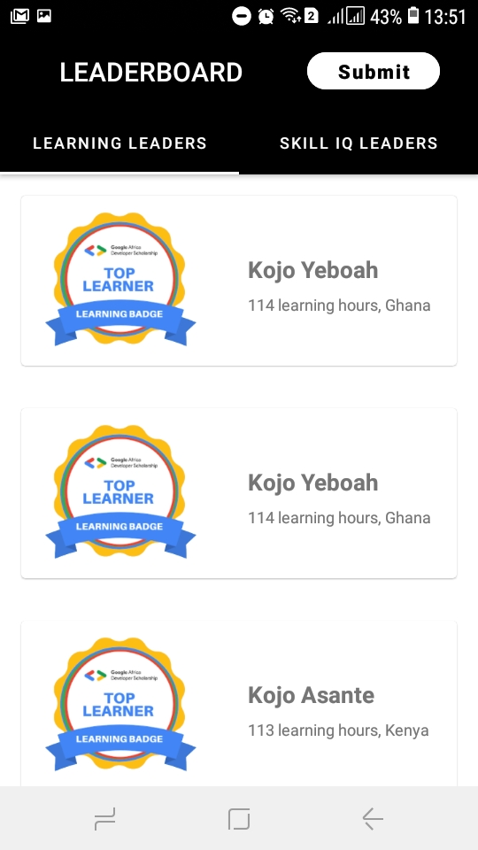

# GADS-Leaderboard
GADS 2020 Leader board android app.

## Screenshots:

## Generating signed APK
From Android Studio:
1. ***Build*** menu
2. ***Generate Signed APK...***
3. Fill in the keystore information *(you only need to do this once manually and then let Android Studio remember it)*

## Maintainers
This project is mantained by:
* [Musavili](https://github.com/Musavili/)

## Contributing

1. Fork it
2. Create your feature branch (git checkout -b my-new-feature)
3. Commit your changes (git commit -m 'Add some feature')
5. Push your branch (git push origin my-new-feature)
6. Create a new Pull Request

